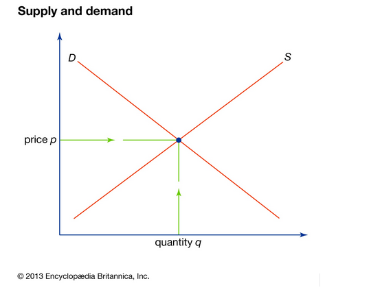
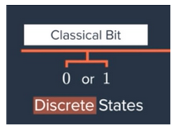
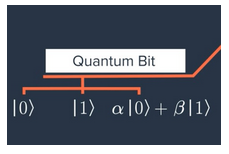

## Explain to a layperson what theoretical chemistry/physics is, in the general context of Franck-Condon Factors
 
We can learn a lot about the structural properties of matter (atoms and molecules) by understanding how matter interacts with light. 
This understanding also tells us about the energy levels of molecules. The energy of a molecule can be stored in a few ways - vibrational, 
rotational, and the energy of electrons, which can be excited. Another piece of the puzzle are the wavelengths of molecules - if you understand 
the system's wavelengths you can calculate everything you need to know about the system. We can separate these wavefunctions into three wavefunction
parts which describe its vibration, rotation, and electrons. When we excite an electron the vibrational part of the wavefunction undergoes changes, 
and we can calculate the Franck-Condon Factors from these changes. 
 
## What is the importance of theoretical chemistry/physics from an economic point of view

Allowing people to do things that they couldn’t do before more efficiently has both revenue and cost side implications.
So, we are essentially creating a new supply/demand curve, but one which is affected by classical computing advances since 
it is currently an effective substitute. From a revenue/demand perspective, there are all these things that customers have wanted to do 
(e.g. understand reactions/catalysts, molecular properties) but haven’t been able to do because they are intractable on classical computers. 
We have learned that the market size is calculated at the point where the demand curve intersects the y-axis. This is a relatively 
small market at the moment, especially in this NISQ era. So, we expect the demand curve intersection with the y-axis to sit fairly low. 
That said, since initial customers are large enterprise customers, we expect the customers that are early adopters to be relatively price 
inelastic - the demand curve will not be very flat or very steep. In other words, we do not think customers will be very price sensitive - increases
in price shouldn’t lead to a massive churn of customers. 

We expect a similar supply curve, not too flat or not too steep - an incremental increase on the supply side, for example, adding one more startup, 
shouldn’t affect pricing as much. In mature markets with several suppliers it is easier for customers to compare prices and benchmark. 
But this is a new market, so changes in pricing shouldn’t drastically impact the number of suppliers in the market. 
Also, there is an opportunity with quantum to offer something truly unique where pricing is not set. 
The company Agnostiq is a good example - how many companies are focused on securing data to the quantum cloud and focused on financial services companies? 
There are probably only half a dozen or less. This means that the company, assuming customers see value, have a reasonable amount of pricing power 
since price is unknown to both parties. That said, customers are smart and they will benchmark with existing SaaS data science service providers 
or some other comparables. But even so, enterprise SaaS services can range widely on pricing, so we think startups can start with high prices 
and then just see if adjustments are needed during price discovery (i.e. talking/negotiating with customers). 
 
Having said all of this, startups, especially in an entirely new industry with arguably little urgency to buy, do not have great leverage. 
Bigger customers know that a deal could essentially put your company on the map. In the beginning, startups will need to give up more in terms
of the economics (“free” pilot periods) for the sake of learning, proof of concepts, and earning trust.

On the cost side, quantum computing promises more accurate results, and a less time consuming process. 
When these cost benefits come online, we expect that the supply curve would shift to the right. 
This means that the price is lower at every quantity demanded. 
 
See image below - we expect supply and demand curves to be “normal” - not too flat and not too steep. 
When cost decreases occur, we would expect the supply curve to shift out. 

## Explain to a layperson what a quantum circuit is and its relationship to theoretical chemistry/physics

First, let’s understand the difference between classical and quantum circuits by discussing their logical elements or bits. 
Classical computers process information using transistors each of which can store one bit of information - we call this a classical bit. 
A classical bit is binary; it can be in one of two states - a 0 or a 1. These are discrete, robust states that can be measured. 

We can contrast this with a quantum computer where the logical elements are quantum bits or qubits. Qubits can also be set into state 0 or state 1. 
But, since qubits follow the law of quantum mechanics they can do much more. For example, a qubit can be in a superposition state 
which is a single state that carries aspects of both a 0 state and a 1 state simultaneously! 

Nature operates quantum mechanically, and so essentially nature is a quantum computer itself. That means that chemistry/physics are inherently quantum.
So, logically, it follows that if you want to understand natural systems then the most accurate way would be doing so with a system 
that is also quantum mechanical - i.e. a quantum computer. This is summed up nicely with a quote from the famous physicist Richard Feynman:
<em>“Nature isn't classical, dammit, and if you want to make a simulation of nature, you'd better make it quantum mechanical, and by golly 
it's a wonderful problem, because it doesn't look so easy.” </em>

